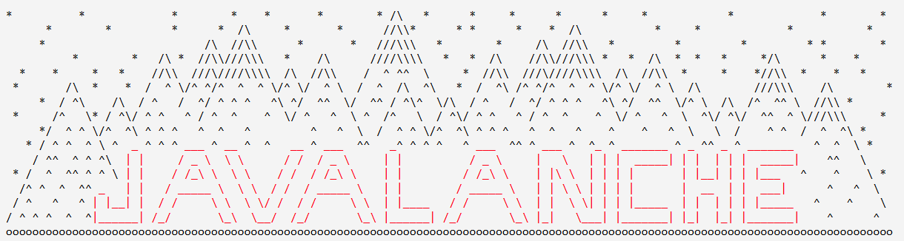
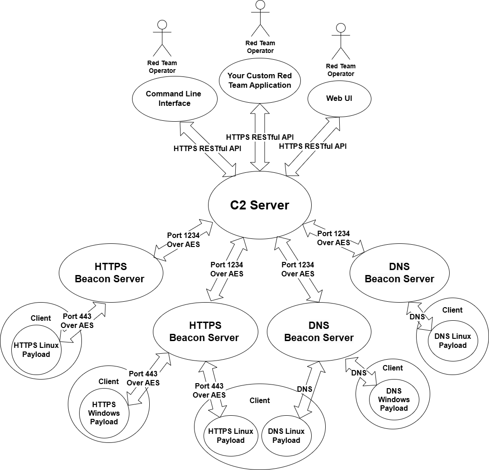

Javalanche is a Command & Control (C2) tool developed by James Southcott and Danny Nichols for the RITSEC Red Team. Javalanche is meant to be used in Red Vs. Blue style Cybersecurity Competitions for educational purposes.

## Features

AES + RSA Implemented by hand
- Talk: https://www.youtube.com/watch?v=gNCsPdkQKHw
- Should you ever roll your own crypto? No, but it's super cool for a project like this!

Multiple Operator Methods
- A Web UI and CLI are available for operators to connect to the C2 Server
- The API allows any Red Team to create their own tool for Operators to use
- Multiple operators operate on the server at once (up to what the underlying OS specs can handle)

AES + DNS Payloads
- The Server can support multiple DNS and AES Beacons at the same time.
- AES and DNS Payloads can run on the same system, and the server will which payload executes commands
- AES Payload has a constant connection, DNS Payload has a configurable callback time

Real Time Shell
- When the AES payload is connected, a real time shell is always available to an operator
- This took some Java threading skills, was really fun to implement

## Deployment

**Installation**

For a production ready instance, copy our installation one liner into a terminal
```bash
curl -L https://javalanche.net/install.sh | bash
```

For Developers, see the following to build javalanche from your development branch
```bash
curl -L -o install.sh https://javalanche.net/install.sh
./install.sh -branch your-dev-branch
```

**Servers**

```bash
# C2 Server
javalanche C2

# At least 1 AES or DNS Proxy Server is required.
javalanche Beacon
javalanche DnsBeacon

# CLI
javalanche CLI
```


## Network Diagram:



For extended documentation, see Setup/setupDocumentation.txt or Setup/serverDocumentation.txt