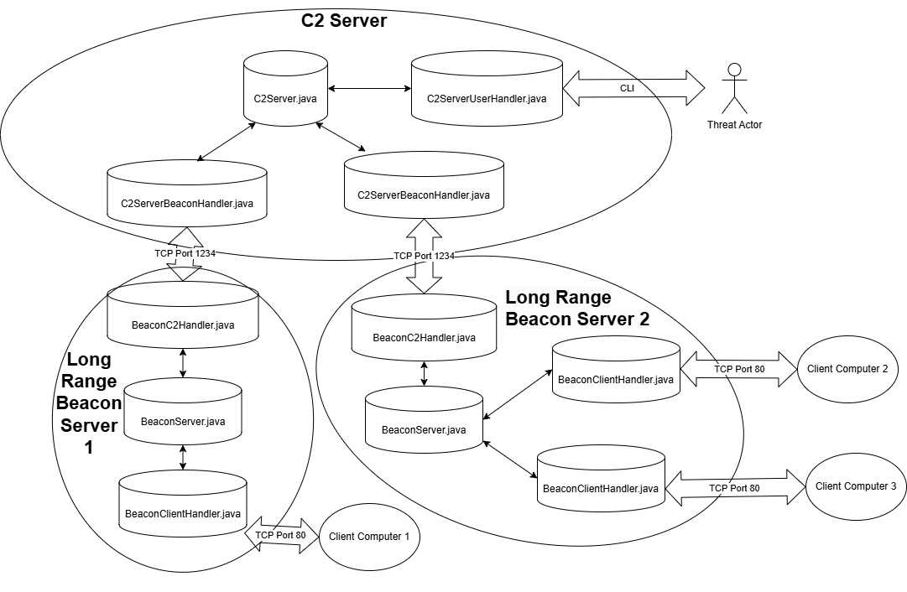
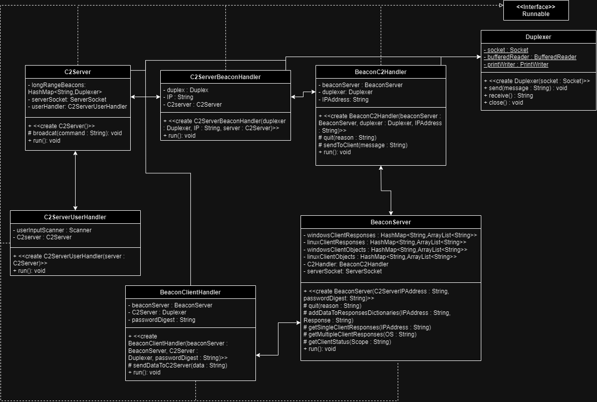

This is a tool developed by James Southcott and Danny Nichols for the RITSEC Red Team Recruiting Process.

This tool is meant to be used in Red Vs. Blue style Cybersecurity Competitions for educational purposes.

# Deployment

**Agents**

We recommend using Ansible to remotely deploy Windows and Linux agents.

```
Prerequisites: A Linux machine with SSH access to all linux competition mahcines, and winrm access to all windows compeitition machines
$ sudo apt update
$ sudo apt install curl, ansible
$ sudo curl -o inventory.yml https://gitlab.ritsec.cloud/jms9508/Javalanche/-/raw/main/Setup/Ansible/inventory.yml?ref_type=heads
$ sudo curl -o playbook.yml "https://gitlab.ritsec.cloud/jms9508/Javalanche/-/raw/main/Setup/playbook.yml?ref_type=heads"
Note: In some competitions, you will be provided an inventory.yml file for deployment. 
You will have to edit the hosts: line in the playbook to reflect the group of hosts to deploy to.
If you are not given an inventory.yml file, you will need to edit the existing inventory.yml 
file to include the proper hosts, usernames, and passwords
$ ansible-playbook -i inventory.yml playbook.yml 
```

**C2 Server**

We recommend Deploying the C2 Server on a linux machine, for the best experience

```
$ sudo apt update
$ sudo apt install curl
$ sudo mkdir /home/javalanche
$ cd /home/javalanche
$ sudo curl -o serverSetup.sh https://gitlab.ritsec.cloud/jms9508/Javalanche/-/raw/main/Setup/ServerSetup.sh?ref_type=heads
$ sudo chmod +x serverSetup.sh
$ sudo ./serverSetup.sh
```

**Proxy Server**

We recommend Deploying the Long Range Beacon Servers on a linux machine, for the best experience.

```
Prerequisite: The Proxy Server must have a Public IP Address. If you are not able to obtain a Public IP Address, 
then both the Proxy and C2 Servers must be deployed on the same WAN as the competition machines.
$ sudo apt update
$ sudo apt install curl
$ sudo mkdir /home/javalanche
$ cd /home/javalanche
$ sudo curl -o serverSetup.sh https://gitlab.ritsec.cloud/jms9508/Javalanche/-/raw/main/Setup/ServerSetup.sh?ref_type=heads
$ sudo chmod +x serverSetup.sh
$ sudo ./serverSetup.sh -server Beacon
```

# Network Diagram:



Main C2 Server - Java

    C2Server.java - Listen for connections from Long Range Beacons. Interacts with the Long Range 
    Beacon Handler Threads, as well as the User Handler Thread.

    C2ServerBeaconHandler.java - Every time a connection from a new Long Range Beacon Server is created, 
    a new thread is created using this class. This thread will send and receive messages from the Beacons, 
    based on whatever the User Operating the C2 requests. These threads interact with the Main C2 Server.
    
    C2ServerUserHandler.java - One thread is created at the beginning of the execution of the C2 Server. 
    This thread is what the User Operating the C2 will interact with via CLI. This thread interacts with 
    the main C2 Server. The options for the user are seperated into 3 groups, Commands, Attack Chains, and
    Requests for data. The Commands option simply sends whatever command is desired to the client (ex. New-
    ADUser). Attack Chains are more involved attacks. Under the hood, they act the exact same as sending
    Commands, but the commands are pre written, so the user does not have to write them out themselves
    (ex. Change the Client Computer's keyboard layout to French, German, then back to English). Requests
    for data just returns the results of commands run from desired machines.
    

Long Range Beacon Server - Java

    BeaconServer.java - The Main Server for the Long Range Beacon. This server will listen for connections new 
    clients (victims). Whenever a new client makes a connection, a new thread will be created using the 
    BeaconClientHandler.java class. The BeaconServer is responsible for maintaining data structures of all of
    it's current clients, as well as all responses to commands from clients.

    BeaconClientHandler.java - After a client makes a connection, this class will be used to create a new thread. 
    This thread is responsible for sending and receiving input to each client, after the Long Range Beacon Server sends 
    commands to the victims. This thread is also responsible for encryption/decryption (currently a simple 13 character 
    rotational cipher) of messages between the Beacon Server and the client

    BeaconC2Handler.java - When the Long Range Beacon Server is started, a new thread is started from this class. 
    This thread is responsible for interacting with the C2 Server, accepting commands from the C2, and taking the 
    proper action based on these commands. All of these commands map to one or more functions defined in 
    BeaconServer.java. These commands will do one of two things; 1. Send commands to Victims (ex. ps> New-ADUser); 
    2. Provide data to the C2 Server (ex. Connection Status of all of the vicims, responses of victims to certain 
    commands)

Networking

    Duplexer.java - This Java Class is utilized by all of the Servers. It is meant to simplify networking java networking
    instructions, down to just send() and receive().

Payloads

    windowsPayload.ps1 - This Powershell Script is the Payload for all Windows clients. The Payload does a few things, 
    incuding: Add a backup script to reacquire the main payload, scheduled tasks for both the payload and backup script,
    firewall rules, extra Users, and the tcp connection via port 80 with the Long Range Beacon. The Payload also handles
    encryption/decryption (currently a simple 13 character rotational cipher) of messages between the client and the
    payload.

    linuxPayload.bash - This Bash Script is the Payload for all Linux Clients. The Payload is extremely similar to the
    Windows Payload, including a backup script, cronjobs for both the main payload and backup script, firewall rules,
    extra users, the tcp connection with the Long Range Beacon, and encryption/decryption.

UML:


# TODO

Add Linux Attack Chains,

Fix linux cronjobs/Service,

Fix Ansible Windows Deployment,

Fix Status Tests

Look into Bitsadmin to transfer files,

the goose,

Implement AES + RSA for HTTPS

Fix UML / Network Diagram